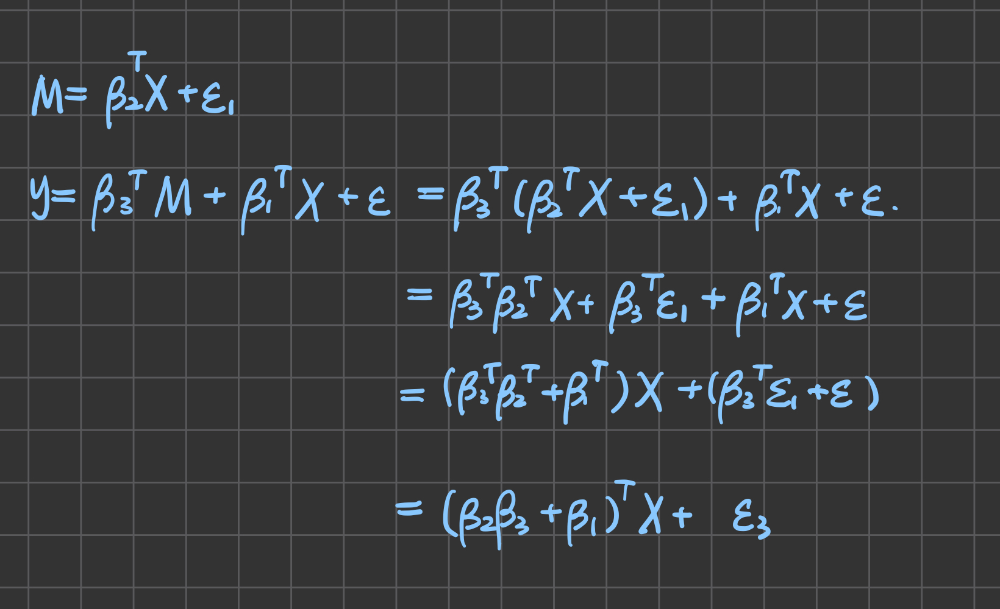
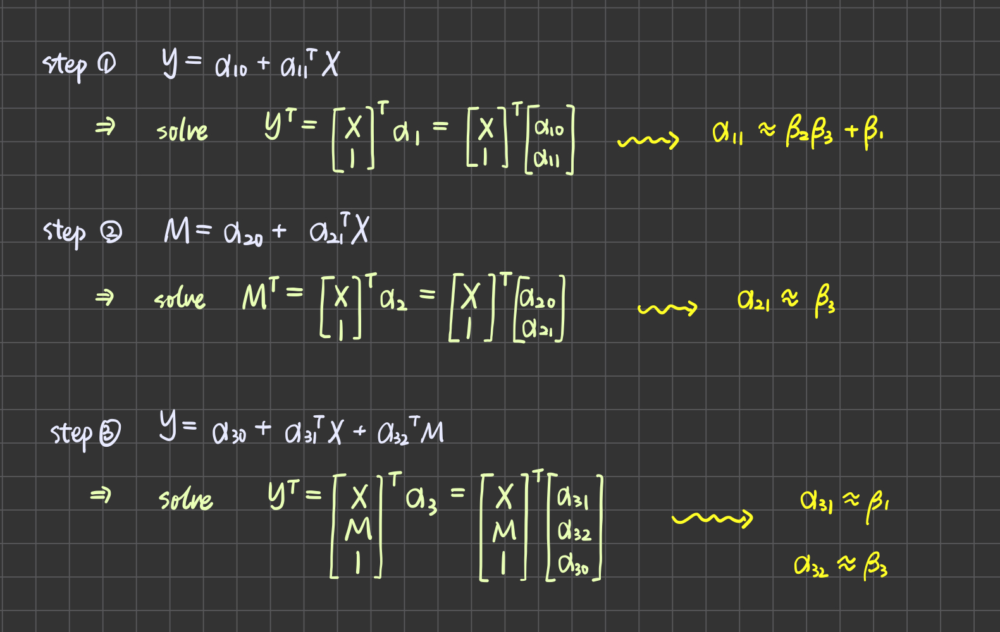

# Simulation

List of variables
|variable|dimension|notes|is input?|
|:---:|:---:|:---|:---:|
|`n`|1|number of samples|O|
|`p_otu`|1|number of `exposure` OTU populations|X|
|`p_med`|1|number of mediators|X|
|`exposure`|`p_otu` * `n`|OTUs|X|
|`mediator`|`p_med` * `n`||X|
|`outcome`|`n` * 1|target OTU|X|
|`b1`|`p_otu` * 1||O|
|`b2`|`p_otu` * `p_med`||O|
|`b3`|`p_med` * `1`||O|

Denote `exposure` with `X`, `mediator` with `M`, and `outcome`  as `Y`; denote random Gaussian noise with epsilons. The mediation effect is simulated with the following equations:

# Estimation

Estimate using B&K steps, the formula are listed below:
